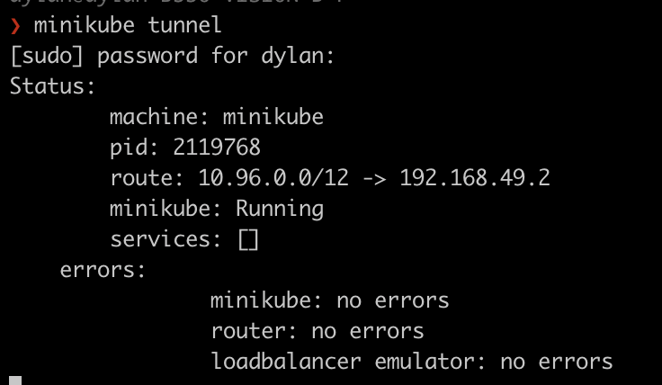

# Deploying to Minikube

[Minikube](https://minikube.sigs.k8s.io/docs/) the most popular way of deploying kubernetes to a local testing environment. There are many other options, but the instructions contained here should be able to be used with other providers.

# Setup

1. Install Minikube: https://minikube.sigs.k8s.io/docs/start/?arch=%2Fmacos%2Fx86-64%2Fstable%2Fbinary+download
1. Install Terraform: https://developer.hashicorp.com/terraform/install
1. Clone this repository: `git clone https://github.com/kadreio/relativistic`
1. CD into the directory: `cd relativistic`
1. Install the kubernetes command line tool `kubectl`: https://kubernetes.io/docs/tasks/tools/
1. Configure helm: https://helm.sh/
1. Set up terraform: `terraform init`

# Getting Started
Once you have minkube and terraform installed, you can spin up a datastack simple by running

1. `terraform apply` then type in `yes` to confirm
1. While terraform is deploying all the infrastrucutre to your minikube environment, you can also see the state of all the pods with `kubectl get services,pods`
1. `minikube tunnel`. After everything's deployed, you'll want to actually log into the various platforms, but by default kinkikube networking is separate from the rest of your machine. Minikube local will bridge the networking, and show you the IP you can access the services. For instance, in the following image, the services are exposed on `192.168.49.2`

1. Relativistic has a series of "exposures" of the various services, here are the default ports 
    - Airflow: 30081
    - Airbyte: 30080
    - Superset: 30082